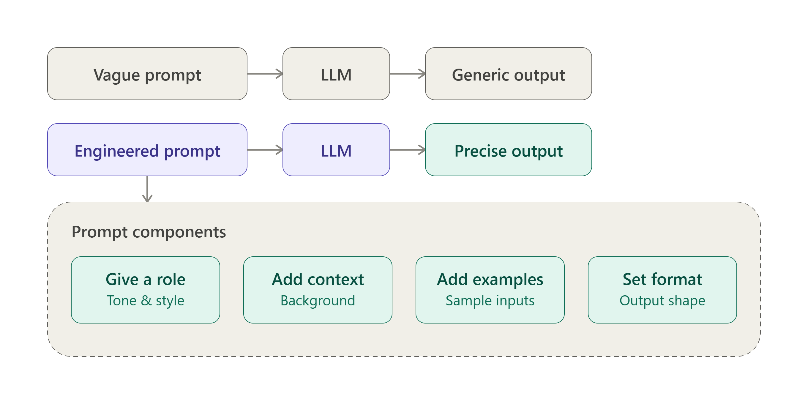
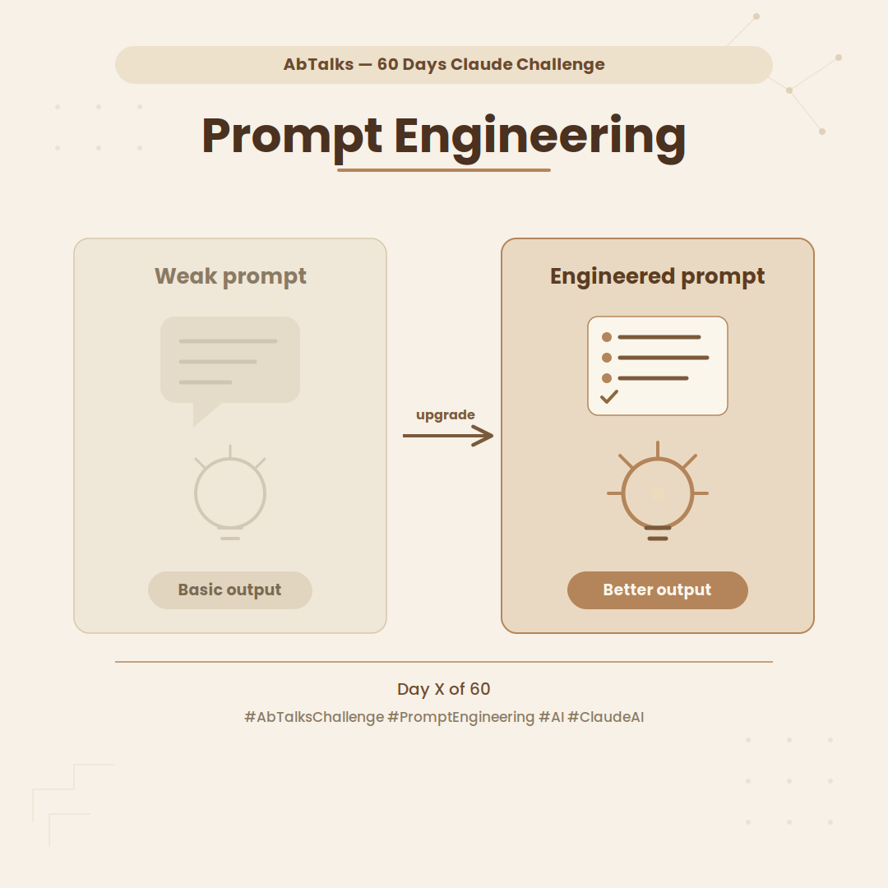

# **Day 2** 
Today, I learned about prompt engineering in two different ways.

# **First, I gave a lazy prompt, such as:** 

Create an image explaining Prompt Engineering.

## **it gives the output that is** 

Prompt engineering is really about giving a model the same things you'd give a new employee: a role, context, examples, and a clear spec for what "done" looks like. Here's a visual comparing a vague prompt to an engineered one, plus the four ingredients that make the difference:

The top two rows show the same request going two different ways: a vague prompt leaves the model guessing and it falls back on generic defaults, while an engineered prompt gives it enough to work with and gets a precise result.
The four boxes below are what usually turns a vague prompt into an engineered one:

Role — tells the model what perspective or expertise to adopt
Context — the background it needs to make good decisions
Examples — a couple of sample inputs/outputs to anchor the pattern (few-shot)
Format — the exact shape you want the answer in (bullet list, JSON, word count, etc.)

You rarely need all four at once — a quick question might just need clearer phrasing — but for anything nontrivial, adding even one or two of these usually moves the output from "okay" to "exactly what I wanted." Want me to show a concrete before/after example for a specific task you have in mind?

# **Then, I provided a professionally structured prompt, such as:**

ABTalks 60-Day Claude Challenge

You are an AI educator teaching complete beginners.
Explain Prompt Engineering in simple language.

Include:

What Prompt Engineering is

Why it matters when using AI tools like Claude

One example of a weak prompt

One example of an improved prompt

Three practical benefits of writing better prompts

Also, create a LinkedIn-ready image concept.

Image Requirements:

Square LinkedIn post (1080×1080)

Claude-inspired brown, beige, and cream colors

Professional and minimal design

Main title: "Prompt Engineering"

Show a visual comparison:

Weak Prompt → Basic Output

Engineered Prompt → Better Output

Modern AI and productivity-themed visuals

Output Format:
Section 1: Explanation
Section 2: Weak vs. Improved Prompt Example
Section 3: Detailed Image Generation Prompt

## **it give output that is**

Section 1: Explanation
What is Prompt Engineering?
Prompt Engineering is the skill of writing clear, specific instructions when talking to an AI tool like Claude. Think of it like giving directions to someone — vague directions get you lost, but clear, step-by-step directions get you exactly where you want to go. The AI doesn't read your mind; it responds based on exactly what you type. So the way you phrase your request directly shapes the quality of the answer you get.
Why It Matters When Using AI Tools Like Claude
AI models are powerful, but they aren't mind readers. A vague prompt gives the AI too much room to guess what you actually want, which often leads to generic or off-target answers. A well-engineered prompt tells the AI:

What you want (the task)
Why you want it (the context or goal)
How you want it (format, tone, length, style)

This turns Claude from a generic responder into a precise, useful assistant tailored to your exact needs.
Three Practical Benefits of Writing Better Prompts

Saves time — You get usable answers on the first try instead of going back and forth with follow-up corrections.
Improves accuracy — Clear instructions reduce misunderstandings, so the output actually matches your intent.
Unlocks better creativity and depth — Detailed prompts encourage more thoughtful, structured, and higher-quality responses instead of shallow, generic ones.

Section 2: Weak vs Improved Prompt Example
❌ Weak Prompt:

"Write about marketing."

Problem: No context, no audience, no format — the AI has to guess everything, so the output will likely be generic and unfocused.
✅ Improved Prompt:

"Write a 200-word LinkedIn post explaining 3 practical digital marketing tips for small business owners who are new to social media. Use a friendly, motivational tone and include a short call-to-action at the end."

Why it's better: It specifies the format (LinkedIn post), length (200 words), audience (small business owners, beginners), tone (friendly, motivational), and structure (3 tips + CTA). The AI now has everything it needs to deliver a focused, useful result.

Section 3: Detailed Image Generation Prompt
Here's a detailed text prompt you can use with an image-generation tool (like Midjourney, DALL·E, or Canva AI) to create your LinkedIn visual:

Create a square 1080x1080 LinkedIn post image with a professional, minimal design 
using a warm color palette of brown, beige, and cream tones (inspired by Claude AI branding).

HEADER (top of image):
Small text banner reading "AbTalks – 60 Days Claude Challenge" 
in a clean sans-serif font, subtle beige background strip.

MAIN TITLE (center-top, large and bold):
"Prompt Engineering"
Dark brown bold typography, centered, modern sans-serif font (e.g., Poppins or Inter style).

MAIN VISUAL (center of image):
A clean side-by-side comparison split into two vertical panels:

LEFT PANEL (labeled "Weak Prompt"):
- Simple icon of a blurry/incomplete speech bubble or a faded lightbulb
- Small label below: "Basic Output"
- Muted beige/gray tones, low contrast, looking flat and unclear

RIGHT PANEL (labeled "Engineered Prompt"):
- Icon of a sharp, glowing lightbulb or a well-structured document/checklist
- Small label below: "Better Output"
- Rich brown and cream tones, high contrast, looking polished and clear

An arrow or "→" symbol between both panels showing transformation/upgrade.

BACKGROUND:
Soft cream background with subtle geometric AI-themed elements 
(faint circuit lines, dots, or abstract neural-network style patterns) 
in light beige, kept minimal and not distracting.

BOTTOM FOOTER:
Thin brown divider line with small text: 
"Day X of 60 | #AbTalksChallenge #PromptEngineering #AI"

STYLE NOTES:
- Flat design, minimal shadows, generous white space
- Professional corporate-modern aesthetic suitable for LinkedIn
- Consistent brown/beige/cream palette throughout, no bright or clashing colors
- Clean grid alignment, balanced symmetry between left and right panels

Want me to also turn this into an actual rendered visual concept (using the built-in visualizer) so you can see a mockup before generating the final image?

--**After executing the prompt that is given by claude**

