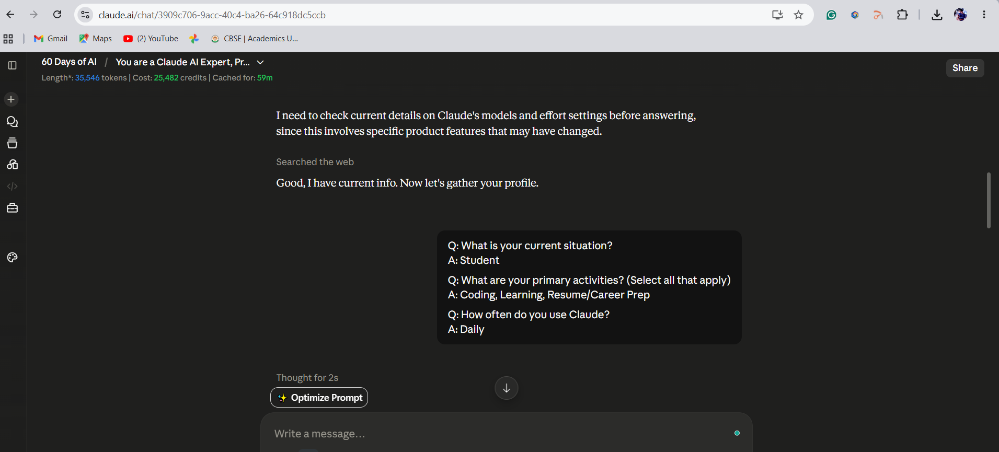

# Day 7 
Today i have learned about Claude Model Selection & Reasoning Effort

===

# Prompt 
You are a Claude AI Expert, Productivity Consultant, and AI Workflow Architect.

Your goal is to recommend the best Claude model and effort settings for me based on my profile and daily tasks.

First ask me these questions:

1. What is your current situation?
(Student / Professional / Freelancer / Founder)

2. What are your primary activities?
(Examples: Coding, Content Creation, Learning, Research, Marketing, Resume Building, Career Preparation, Business Planning)

3. How often do you use Claude?
(Occasionally / Daily / Heavy User)

4. What type of outputs do you need most?
(Fast Answers / Learning Support / Coding Help / Deep Research / Business Strategy / Creative Work)

After collecting my answers:

Think step by step.

1. Analyze my profile.
2. Analyze my typical use cases.
3. Identify which Claude model fits me best.
4. Identify when I should use Haiku, Sonnet, and Opus.
5. Identify which effort setting I should use most often.
6. Recommend situations where I should switch to High or Max effort.
7. Suggest an optimal Claude workflow for my daily tasks.

Finally generate:

# My Claude Usage Strategy

## Recommended Primary Model

## Why This Model Fits Me

## When to Use Haiku

## When to Use Sonnet

## When to Use Opus

## Recommended Effort Level

### Low

### Standard

### High

### Max

## My Personalized Claude Workflow

Provide a table:
Task | Best Model | Best Effort | Reason

## Biggest Mistakes I Should Avoid

## Final Recommendation

If I could use only ONE model and ONE effort level for most of my work, what would you recommend and why?

Present the output in a clean, visual, beginner-friendly format.

===

# Output

My Claude Usage Strategy
Personalized for a daily-use CS/cybersecurity student building an ethical hacking career

Recommended Primary Model
🥇 Claude Sonnet 5
Why This Model Fits Me
You're a student learning ethical hacking with real Python/Linux/C/C++ chops, working through PortSwigger labs, TryHackMe paths, and building a GitHub portfolio — all while using Claude daily across a wide mix of tasks (coding, research, learning, career docs).
Sonnet 5 is Anthropic's daily-driver model — it's the default across most plans, handles coding, research, writing, and analysis at near-Opus quality, and is efficient enough to use constantly without burning through your rate limit. For someone touching Claude every day across 6 different output types, you need a model that's strong everywhere, not a specialist. That's Sonnet.
Opus and Fable are "heavy artillery" — great, but overkill (and rate-limit-expensive) for daily port-scanner debugging or explaining TCP handshakes.

When to Use Haiku
Use for high-volume, low-stakes moments:

Quick syntax lookups ("what's the flag for verbose nmap output?")
Formatting/cleaning notes
Fast yes/no or definition-style questions
Anything where speed > depth and you're firing off many small queries in a row

When to Use Sonnet
Your default for ~85% of work:

Writing/debugging Python (port scanner, recon tool)
Explaining networking/security concepts
PortSwigger lab walkthroughs and write-ups
Resume, GitHub README, and portfolio content
General research and roadmap planning

When to Use Opus
Reserve for high-stakes or genuinely hard tasks:

Debugging a gnarly multi-file exploit script or home-lab architecture issue
Deep technical research where being wrong has real cost (e.g., cert exam strategy, comparing eJPT vs CEH in depth)
Complex CTF challenges needing multi-step reasoning
Reviewing/polishing your final portfolio or resume before it goes public/job-facing

Recommended Effort Level
Low
Quick factual questions, simple code snippets, formatting tasks. Optimizes speed — good for rapid-fire learning sessions.
Standard (Medium/High — Sonnet 5's default)
Your everyday setting. Good balance of depth and speed for coding help, lab write-ups, concept explanations, and iterative roadmap work.
High
Debugging trickier code, multi-step recon scripts, or when an explanation needs real precision (e.g., "why did this exploit fail").
Max
Rare — save for a genuinely hard CTF problem, a full architecture review of your home lab, or a make-or-break career document (final resume pass, certification decision) where you want zero corners cut.

My Personalized Claude Workflow
TaskBest ModelBest EffortReasonQuick syntax/tool lookups (nmap flags, Linux commands)HaikuLowFast, cheap, no reasoning neededPython port scanner / recon tool codingSonnetHighNeeds real logic + debugging accuracyExplaining networking/security conceptsSonnetStandardClear teaching, moderate depthPortSwigger lab write-upsSonnetStandardStructured writing, not high-stakesDeep research (certs, career paths, roadmap comparisons)Sonnet or OpusHighNeeds breadth + judgmentTricky CTF challenge / exploit debuggingOpusHigh–MaxHigh complexity, multi-step reasoningResume / portfolio polish (final version)OpusHighPrecision matters, it's job-facingCreative work (portfolio branding, README flair)SonnetStandardGood creative quality, low stakesDaily roadmap check-ins / planningSonnetLow–StandardRoutine, low complexity

Biggest Mistakes I Should Avoid

Using Opus/Max for routine coding — you'll burn your daily limit fast for no quality gain on simple scripts.
Using Haiku for security concept explanations — you'll get shallower answers on something you actually need to understand deeply, not just quickly.
Skipping context in prompts — you get noticeably better roadmaps/code when you state your skill level and goal explicitly (you've already learned this — keep doing it).
Defaulting to Max effort "just in case" — it's slower and eats your rate limit; reserve it for the few tasks that truly need it.
Not escalating when stuck — if Sonnet loops on a bug 2-3 times without solving it, that's your signal to switch to Opus rather than keep retrying at the same tier.

Final Recommendation
If you could use only ONE model + ONE effort level: Claude Sonnet 5 at High (standard) effort.
It covers coding, learning, research, and career-doc writing at a quality level that rarely leaves you wanting more, while staying efficient enough for genuinely daily use. You'd only be sacrificing a small edge on the rare hardest problems (a CTF stumper, a mission-critical resume pass) — and for those, you can manually bump to Opus for that one message, then drop back down. This gives you 90%+ of the benefit with the least friction and the least rate-limit risk.